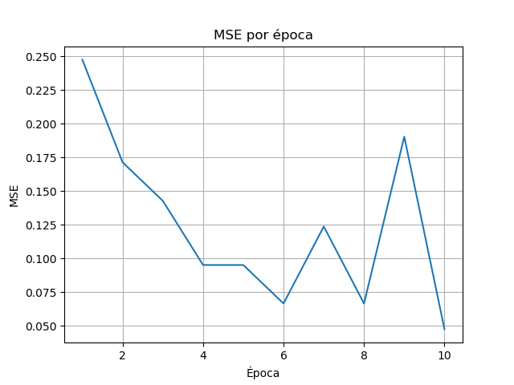
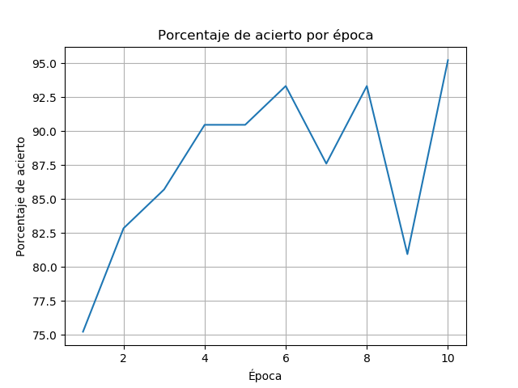

# Tarea 1: Entrenar una red neuronal

En esta tarea se requiere implementar y entrenar una red neuronal de
acuerdo a lo descrito en el enunciado de [este link](./Tarea_1.pdf).

El dataset utilizado corresponde al [Iris Data Set](https://archive.ics.uci.edu/ml/datasets/iris),
que cuenta con 150 ejemplos, 3 clases y 4 atributos. Para realizar la tarea se utilizó
**Python 3.7.4**, junto con las librerías **numpy** y **matplotlib**.

A continuación se indica que contiene cada uno de los archivos del repositorio:

* **Tarea_1.pdf**: Es el enunciado de la tarea.
* **data**: Contiene el archivo iris.data, el dataset con el que se trabaja.
* **plots**: Tiene los gráficos resultantes de la tarea.
* **functions.py**: Contiene la implementación de las funciones Step, Tanh,
Sigmoid y la función de error MSE.
* **Neuron.py**: Posee la implementación de una neurona.
* **NeuralNetwork.py**: Tiene la implementación de una red neuronal.
* **main.py**: Es el programa principal, donde se crea, entrena y prueba
la red, y contiene funciones auxiliares adicionales.

## Sobre la red utilizada

La red creada contiene 4 capas, con 6, 4, 3 y 3 neuronas cada una,
y con las funciones Tanh para las dos primeras y Sigmoid para las dos
últimas, teniendo 4 inputs en la primera capa y 3 outputs en la última.

El dataset se particionó en uno de entrenamiento (70% de los datos) y
otro de testing (30% de los datos) luego de que los datos fueran
revueltos, ya que vienen inicialmente ordenados. Posteriormente se entrenó la
red con 10 épocas particionadas en batch de 35 ejemplos.

Para escojer los pesos iniciales de forma aleatoria se utilizan **semillas**, de
forma que se mantiene la consistencia entre ejecuciones del programa.

## Resultados y gráficos

Al ejecutar el programa **main.py** la red será entrenada y probada,
entregando los siguientes resultados y gráficos:

```
Entrenando...
Época: 1        MSE: 0.2476     Acierto (%): 75.2381
Época: 2        MSE: 0.1714     Acierto (%): 82.8571
Época: 3        MSE: 0.1429     Acierto (%): 85.7143
Época: 4        MSE: 0.0952     Acierto (%): 90.4762
Época: 5        MSE: 0.0952     Acierto (%): 90.4762
Época: 6        MSE: 0.0667     Acierto (%): 93.3333
Época: 7        MSE: 0.1238     Acierto (%): 87.6190
Época: 8        MSE: 0.0667     Acierto (%): 93.3333
Época: 9        MSE: 0.1905     Acierto (%): 80.9524
Época: 10       MSE: 0.0476     Acierto (%): 95.2381

Pruebas con datos de testig:
MSE: 0.0        Acierto (%): 100.0

Matriz de confusión: (Eje x: predicción, Eje y: real)
    0  1  2
0 [13  0  0]
1 [ 0 16  0]
2 [ 0  0 15]
```




## Análisis de resultados

Se puede observar que el error de la red decrece hasta la época 6, donde
luego nos encontramos con dos picos en 7 y 9, para luego encontrar el
mínimo hasta ahora en la época 10. Este comportamiento se ve reflejado
en el porcentaje de acierto, el que aumenta hasta la época 6 decreciendo
nuevamente en las épocas 7 y 9, para encontrar su máximo en la época 10.

Las pruebas con los datos de testing arrojan 0.0 de error y un 100% de
acierto, lo que significa que el modelo no falló con ninguno de los ejemplos
de testing. Lo anterior se refleja en la matriz de confusión, que muestra
13 aciertos para la clase 0, 16 para la 1 y 15 para la 2, sin fallos para
ninguna.

## Análisis sobre implementación, dificultades y eficiencia

La parte más dificil de implementar fue la clase `NeuralNetwork` que
debía manejar la lógica de la interacción entre las capas, sin embargo
al implementar la red con objetos se simplifcan un poco las tareas,
delegando funciones a otras clases más simples como `Neuron`. Por otra
parte, al hacerlo de esta manera se paga con la ineficiencia del programa
para datasets más grandes, por suerte el dataset utilizado solo contiene
150 ejemplos.