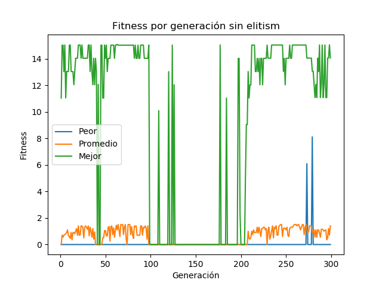
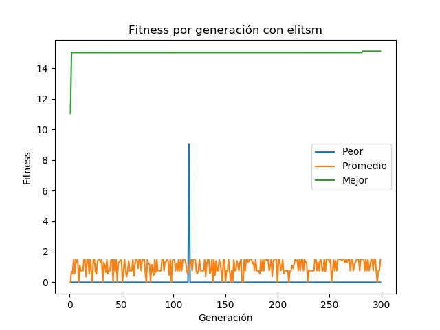
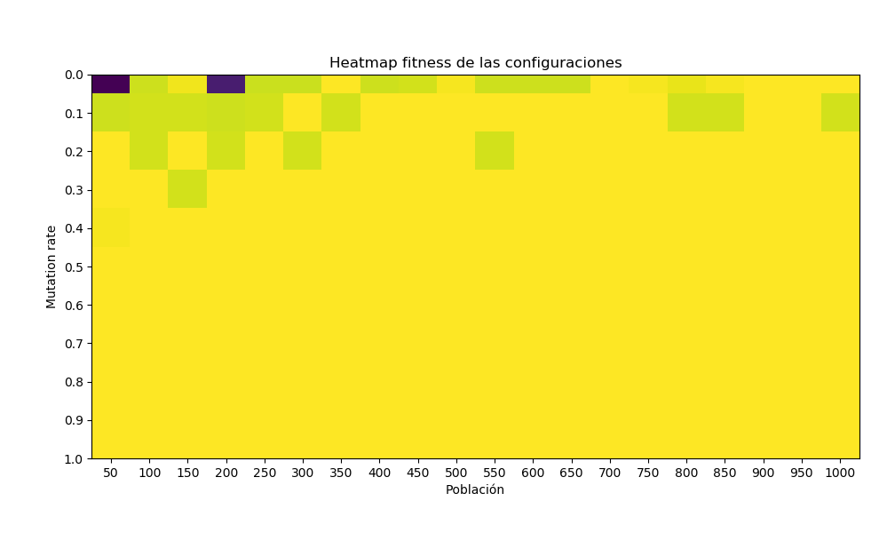

# Tarea 2: Implementación de Algoritmo genético

## Problema: Unbound-Knapsack

Para una mochila que aguanta 15kg, encuentre la combinación de
cajas que maximice el valor contenido en la mochila, pero que no se pase del peso máximo
soportado. Las cajas permitidas son las siguientes:

1. Caja de peso 12 y valor 4.
2. Caja de peso 2 y valor 2.
3. Caja de peso 1 y valor 2.
4. Caja de peso 1 y valor 1.
5. Caja de peso 4 y valor 10.

## Solución

Se considera un individuo a una lista de 5 valores, donde cada posición corresponde
a las cajas mencionadas anteriormente, en orden, y el valor de la posición, es decir,
el gen, correponde a la cantidad de cajas para ese tipo de cajas.

La función de fitness que se escogió fue (peso total de la mochila) + 1 / (1 + (valor total)).


## Resultados

Con una condición de termino de 300 iteraciones se obtuvieron dos soluciones,
una sin elitism y otra con elitism:

```
Solución sin elitism:
Cajas de 12 kg: 0        Valor: 0
Cajas de 2 kg: 4         Valor: 8
Cajas de 1 kg: 2         Valor: 4
Cajas de 1 kg: 4         Valor: 4
Cajas de 4 kg: 0         Valor: 0
Peso total: 14 kg        Valor total: 16
Fitness de la solución: 14.058823529411764

Solución con elitism:
Cajas de 12 kg: 1        Valor: 4
Cajas de 2 kg: 1         Valor: 2
Cajas de 1 kg: 0         Valor: 0
Cajas de 1 kg: 1         Valor: 1
Cajas de 4 kg: 0         Valor: 0
Peso total: 15 kg        Valor total: 7
Fitness de la solución: 15.125
```

Además se obtuvieron los siguientes gráficos para las mismas soluciones:




También se obtuvo un heatmap para todas las combinaciones de la
población en el rango [50, . . . , 1000] yendo de 50 en 50, y la tasa de mutación entre
[0.0, . . . , 1.0] de 0.1 en 0.1.

El heatmap muestra el mejor fitness obtenido para 100 iteraciones en cada
configuración.




## Análisis

Para el caso del heatmap podemos observar que en el caso de poblaciones más
pequeñas tener un mayor mutation rate ayuda a encontrar una mejor solución,
mientras que para poblaciones más grandes no es tan importante tener un mutation
rate elevado.

Para los gráficos de fitness por época se observa que ambas soluciones alcanzan
fitness elevados, con fitness promedio similares, pero, sin embargo, se observa
que es mucho mejor utilizar elitism para mantener el mejor individuo hasta el
final, ya que en el otro caso podemos retroceder y terminar con un individuo no
tan bueno.