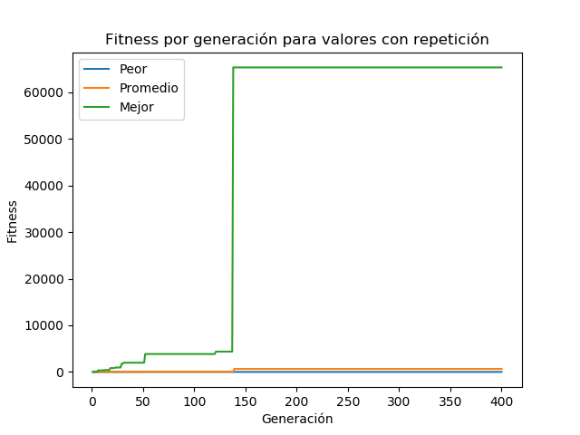
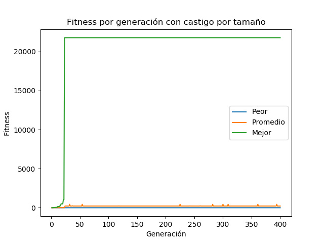
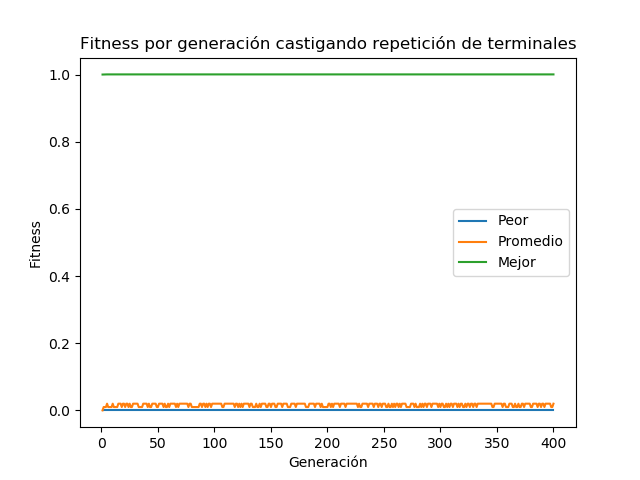
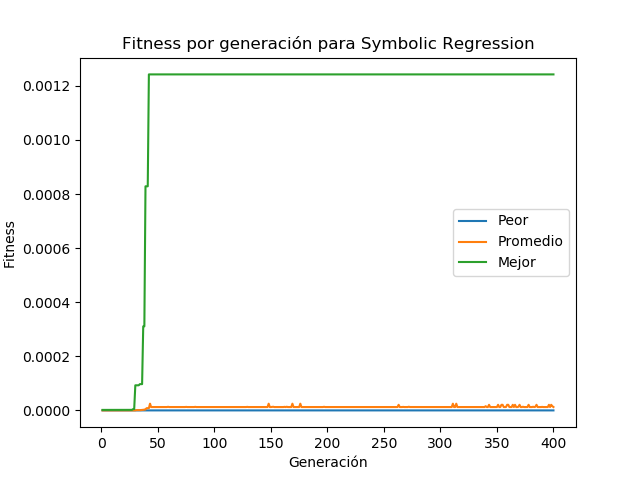
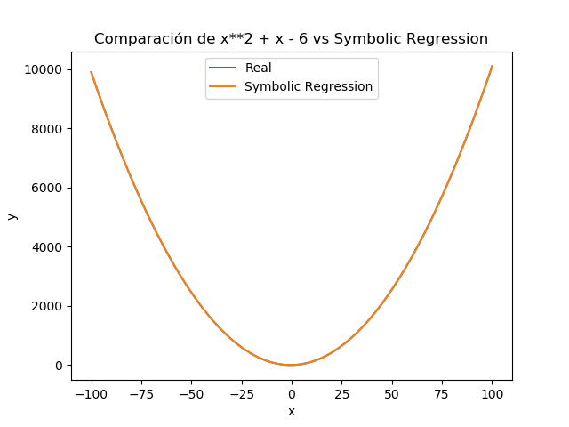
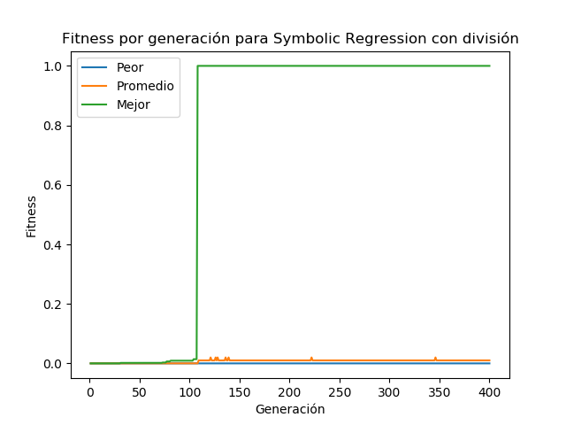
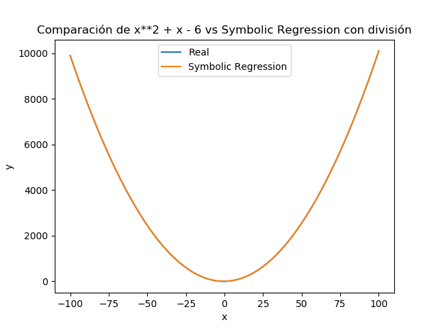
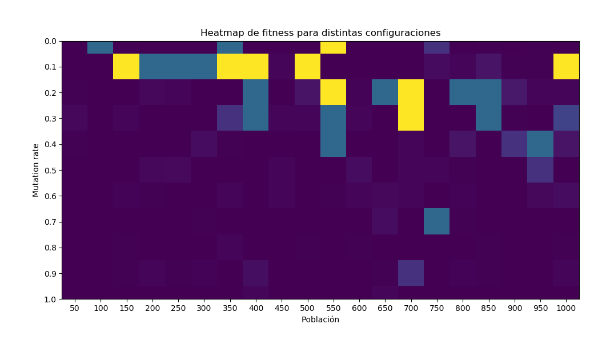

# Tarea 3: Programación genética

En esta tarea se implementó un algoritmo de programación genética que utiliza
crossover, mutation, y elitism para encontrar aproximaciones de números y
funciones.

Se utilizó Python 3.7.4. El archivo main.py ejecuta la mayoría de los experimentos,
mientras que el archivo heatmap.py ejecuta el último experimento.

## Encontrar número

### Sin límite de repeticiones:

Se búsca encontrar el número 65346 utilizando las operaciones {+, -, *, max} y
los números {25, 7, 8, 100, 4, 2}, sin límite de repeticiones de los nodos.

Para encontrar el número se utilizanron los siguientes parámetros:

* Población: 100
* Tamaño de selección: 10
* Mutation rate: 0.2
* Iteraciones: 400

A continuación se muestran los resultados:

```
Sin límite de repeticiones:
        Mejor fitness: 65346.0
        Solución: 65346       
        Cantidad de nodos: 225
```



El algoritmo logró encontrar el número, consiguiendo una muy buena aproximación
bastante temprano, cerca de la iteración número 150.

### Fitness:

Para el siguiente experimento se castigó a los árboles que crecen demasiado,
teniendo como medida de tamaño la cantidad de nodos.
Los parámetros son los mismos del experimento anterior.

```
Fitness castigando árboles grandes:
        Mejor fitness: 21781.63
        Solución: 65344        
        Cantidad de nodos: 37 
```



Podemos observar que se disminuyó drasticamente el número de nodos
utilizados y la solución es bastante buena. Incluso, el algoritmo logró
encontrar una muy buena aproximación cerca de la iteración 25.

### Sin repetición:

En el siguiente experimento se castigó a los árboles que repetían nodos
terminales. Se utilizan los mismos parámetros anteriores.

```
Fitness castigando repetición:
        Mejor fitness: 1.0004746229809385
        Solución: 32
        Cantidad de nodos: 9
```



La solución encontrada en este caso fue muy mala, y no mejoró a lo largo de
las 400 iteraciones o incluso corriendo el algoritmo con otros parámetros.

## Implementar variables:

Para esto se modificó el método de evaluación de los nodos, para que recibiera
un diccionario de variables, y se creo una subclase de nodo terminal en cuyo
método de evaluación se utiliza el diccionario que se recibe.

## Symbolic Regression

En esta parte se trata de encontrar la función x^2 + x - 6 para x en [-100, 100],
los parámetros utilizados son los mismos que para los experimentos anteriores.

```
Symbolic Regression:
        Mejor fitness: 0.0012422360248447205
        Cantidad de nodos: 27
```





Podemos observar que se encontró una muy buena aproximación de la función original,
y que esto se logró cerca de la iteración 50.

## Implementar el nodo Division

Para esto se creo un nuevo nodo de operación que simplemente ejecutara la división,
pero en la función de fitness se utiliza un try-catch, para atrapar las excepciones
de división por cero y retornar 0 como el valor de fitness.

Se ejecutó el mismo experimento anterior, esta vez con el nodo para la división,
y los resultados fueron los siguientes:

```
Symbolic Regression con división:
        Mejor fitness: 1.0
        Cantidad de nodos: 29
```





En este caso se obtuvo una solución tan buena como la anterior, pero el algoritmo
se demoró un poco más en encontrarla, fue cerca de la iteración 100 en lugar
de la 50.

## Análisis

En esta parte se generó un heatmap de las configuraciones para el primer
problema, cambiando sin embargo, los parámetros del algoritmo:

* Población: se tomaron poblaciones entre 50 y 1000 con pasos de 50.
* Tamaño de selección: 5
* Mutation rate: se tomaron mutation rates entre 0 y 1.0 con pasos de 0.1.
* Iteraciones: 50



Podemos observar que los fitness más altos (amarillos) se dan para mutation
rates más pequeños, sin importar demasiado el tamaño de la población.
